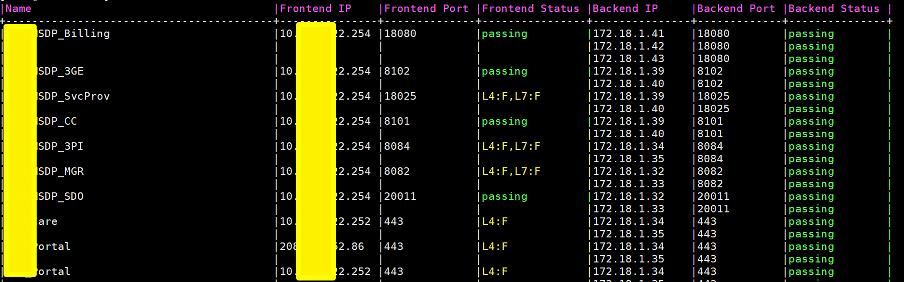

## Purpose

Check load balancing setup healthy or not. Based on the load balancing metadata definition, the script will do L4/L7 check to determine if it works as expected.

## Usage

Based on the load balancing you want to check, prepare a lb.csv file with format below:

```
Name          | Frontend IP    | Frontend Port | Health Check                                | Backend IPs        | Backend Port  | Auth
APP_Billing   | 10.1.202.198   | 18080         | /orchestration/healthCheck                  | 172.16.14.[41:43]  |   18080       | manager:manager@123
APP_3GE       | 172.16.14.126  | 8102          | /sdgui/healthCheck                          | 172.16.14.[39:40]  |   8102        |
APP_SvcProv   | 10.1.202.198   | 18025         |                                             | 172.16.14.[39:40]  |   18025       |
APP_CC        | 172.16.14.126  | 8101          | /sdgcc/healthCheck                          | 172.16.14.[39:40]  |   8101        |
APP_3PI       | 10.1.202.198   | 8084          | /tpim/version.html                          | 172.16.14.[34:35]  |    8084       |
APP_MGR       | 10.1.202.198   | 8082          | /internal-api/wsdl/resourceevent.wsdl       | 172.16.14.[32:33]  |   8082        |
APP_SDO       | 10.1.202.198   | 20011         | /Health.jsp                                 | 172.16.14.[32:33]  |   20011       |
APP_Care      | 10.1.202.200   | 443           |                                             | 172.16.14.[34:35]  |   443         |
APP_Portal    | 10.1.202.201   | 443           |                                             | 172.16.14.[34:35]  |   443         |
APP_MMS_MO    | 10.1.202.198   | 8021          | /mm7                                        | 172.16.14.[9:24]   |   5002        |
APP_LBS_MO    | 10.1.202.198   | 8022          | /ParlayXTlAccess/services/TerminalLocation  | 172.16.14.[9:24]   |   27010       |
```

Put lb-check.py and lb.csv into any folder on your control server with python3 and requests module installed.

```shell
$./lb-check.py -h
Usage: lb-check.py [options]

Options:
  -h, --help   show this help message and exit
  -f FILENAME  lb csv file, default one is lb.csv
  -v           print all information to stdout
```

## Example

./lb-check



- passing: Both L4 and L7(if applicable) checking are good
- L4:F: L4 checking failed
- L7:F: L7 checking failed